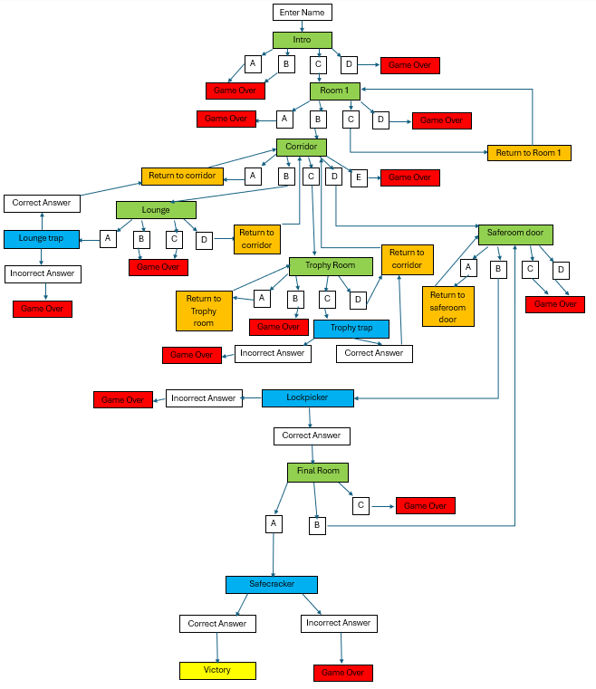

# Word Burglar
Word Burglar is a text-based "choose your own adventure" style game where the player chooses what actions they will take in order to pull off a burglary. This game would be well suited to fans of "choose your own adventure" style books, fans of older text based games, or any person looking for a short gaming experience with some replayability.

## Planning
When planning project 3 I decided I wanted to make a game using python. Given graphics and imagery would not play a significant part in this project, I decided that a text-based game was the best fit.

This decided, I worked out a binary tree which would detail the possible player choices and the outcome each would produce. On a game over in the below chart, the player is presented with the option to play again, which takes them back to the intro scene, or not, which brings them back to the enter name screen.

This diagram provided a way to structure the project such that there were no dead ends. Regardless of what they player does, they are able to continue until they hit a game over or win the game. On victory, they are presented again with the option to play again, as 2 of the rooms are optional, and a first time player may not have experienced them.

## Gameplay
On starting the program, the player is presented with the following:

It is at this point the player ust enter their name, which may be comprised of letters or numbers, and must be between 1 and 15 characters long. Once this is done, they will be presented with their first choice:

The player makes a choice by typing the corresponding letter and then enter. The player always has the option to end the game by selecting the bottom option on the list. As stated above, this will end the game, at which point they can restart.

Once they progress past the first room they reach the corridor which acts as the game's main hub. Here, they are presented with optional challenges. In the lounge room, a challenge is presented where the player must choose the correct answer out of three similar appearing words, 2 being chosen at random from an array.

They can alternatively go to the trophy room, which presents a different puzzle. This one scrambles the letters of a word and the player must decipher it to solve the puzzle.

Finally there are the game's required challenges. The optional ones will end the game instantly if failed, but the player may enter several wrong answers in these and still pass, as they are required for completion.

The first of these is a lockpicking minigame, where the player decides on which direction to move a lockpick to open a door. They are informed on starting that if they enter 3 wrong answers they will fail. They are updated on their number of remaining chances after each failure, and provided a hint to solve the puzzle

The second required puzzle is a safecracking minigame. This uses a list comprehension combined with random sampling to generate a 3 digit code for the save using the numbers 0-3. Initially I had planned to use the numbers 1 - 10, but this proved too difficult to solve with luck alone. As with the lock picking game, they have a limited number of attemps to solve the puzzle.

Bugs

The function to implement the game over initially did not work
A bug arose with the function to show choices for the first room where the wrong choice still progressed the game. Re examination of the code revealed that the if statement has been phrased wrongly, changing it resolved the issue. 

A bug arose also with the possibility of the player attempting to input a choice that doesn't represent one of the options, as this could create a dead end. Nesting the choices inside a while loop resolved the issue

The function to call game over initially resulted in a dead end, this was fixed by implementing user input to allow the player to return to the intro screen or restart the game

A bug arose with a list of strings, attempting to index it created an error saying the index was out of range. Re-examination of the code revealed that the list entries had all been set between a single set of quotation marks, meaning the list only had one entry, and nothing beyond that could be accessed 

The lockpicker function when first written displayed the prompt to move the lockpick twice for the second and third prompts. This was due to incorrect placement of print commands within the nested if statements.

To prevent the player from using names that are too long, a limit of 15 characters was placed on it. Initially after implementing this, an inifinite loop ran if a sequence that was too long was entered. This was resolved by nesting the name input within the while loop validating the input and using a continue statement on incorrect input.

Where user input was required to be longer than one character, it was initially case sensitive, and any answer other than one exactly matching the variable resulted in a fail outcome. This was fixed by using string methods to change the input case to match the variable.

a bug arose in that some functions continued to run after the game had ended, and the player could enter a choice when they should not be able to. Re-examination of the code revealed that break statements had not been entered in every place they were required. Once this was done, the issue was fixed.

The player was initially able to begin the game by putting in an empty space as their name. To prevent this, the strip method was added to the name input.

Submitting an empty entry or a letter into safecracker initially caused the game to crash. This was solved by nesting the inputs within a try except statement to check for value errors. A similar issue happened with lockpicker. The code was refactored to work along the same lines as safecracker, which resolved the issue

Fixes:
If statement:
https://www.reddit.com/r/learnpython/comments/u9ts2r/python_ignoring_my_elif_statement/

Invalid choices
https://stackoverflow.com/questions/64070816/how-to-restart-a-loop-if-the-input-is-wrong

Word scramble:
https://www.youtube.com/watch?v=vtjLxNU6eyk

safecracker:
https://www.reddit.com/r/learnpython/comments/1aeofpv/crack_the_safe_code/

strip:
https://teamtreehouse.com/community/how-do-you-prevent-an-empty-input-field-being-added-to-my-todo-list