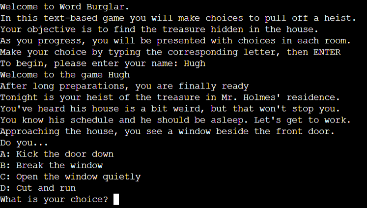
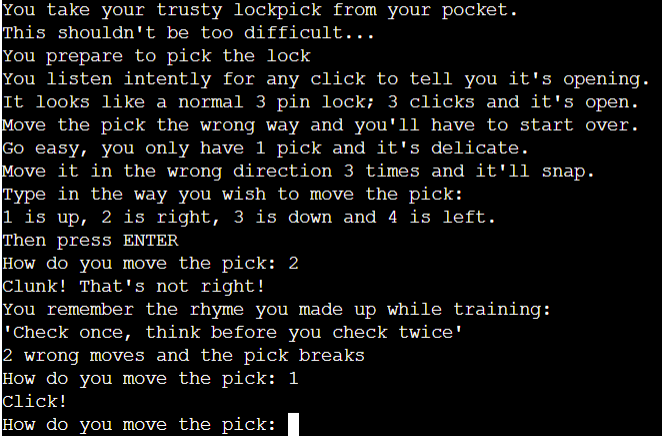
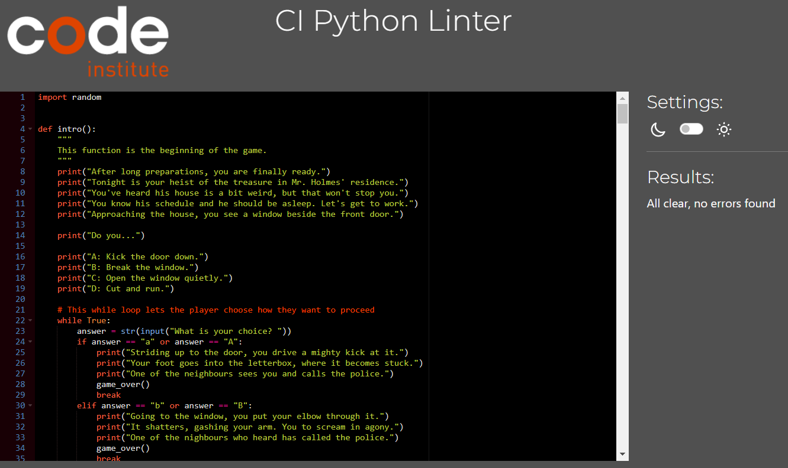

# Word Burglar
Word Burglar is a text-based "choose your own adventure" style game where the player chooses what actions they will take in order to pull off a burglary. This game would be well suited to fans of "choose your own adventure" style books, fans of older text based games, or any person looking for a short gaming experience with some replayability.

## Planning
When planning project 3 I decided I wanted to make a game using python. Given graphics and imagery would not play a significant part in this project, I decided that a text-based game was the best fit.

This decided, I worked out a binary tree which would detail the possible player choices and the outcome each would produce. On a game over in the below chart, the player is presented with the option to play again, which takes them back to the intro scene, or not, which brings them back to the enter name screen.

This diagram provided a way to structure the project such that there were no dead ends. Regardless of what they player does, they are able to continue until they hit a game over or win the game. On victory, they are presented again with the option to play again, as 2 of the rooms are optional, and a first time player may not have experienced them.

## Gameplay
On starting the program, the player is presented with the following:

It is at this point the player ust enter their name, which may be comprised of letters or numbers, and must be between 1 and 15 characters long. Once this is done, they will be presented with their first choice:

The player makes a choice by typing the corresponding letter and then enter. The player always has the option to end the game by selecting the bottom option on the list. As stated above, this will end the game, at which point they can restart.

Once they progress past the first room they reach the corridor which acts as the game's main hub. Here, they are presented with optional challenges. In the lounge room, a challenge is presented where the player must choose the correct answer out of three similar appearing words, 2 being chosen at random from an array.

They can alternatively go to the trophy room, which presents a different puzzle. This one scrambles the letters of a word and the player must decipher it to solve the puzzle.

In both of the above challenges, the player can answer how they wish, including with numbers or by submitting an empty answer. I deemed this to make more sense "in game" as a person in such situations may become flustered and unable to answer. 

Finally there are the game's required challenges. The optional ones will end the game instantly if failed, but the player may enter several wrong answers in these and still pass, as they are required for completion.

The first of these is a lockpicking minigame, where the player decides on which direction to move a lockpick to open a door. They are informed on starting that if they enter 3 wrong answers they will fail. They are updated on their number of remaining chances after each failure, and provided a hint to solve the puzzle

The second required puzzle is a safecracking minigame. This uses a list comprehension combined with random sampling to generate a 3 digit code for the save using the numbers 0-3. Initially I had planned to use the numbers 1 - 10, but this proved too difficult to solve with luck alone. As with the lock picking game, they have a limited number of attemps to solve the puzzle.

On beating it, they are presented with a victory message:

### Unimplemented features
I wanted to insert ascii art of a book, as the games victory message. I also wanted to implement a function to clear the screen after making a choice as it can look cluttered which affects readability.

## Technology Used

Python was used to create the program.
Heroku was used for Deployment and hosting.
Github was used to store code.
Gitpod was used to write the code.
Git was used for version control.

## Testing
Manual testing was conducted on all aspects to ensure the program worked as intended:
| Item being tested | Action undertaken | Expected outcome | Result |
|--|--|--|--|
| Name entry | Submitted empty string as answer |Message saying a name is needed | Pass |
| Name entry | Submitted a space as answer |Message saying a name is needed | Pass |
| Intro | Submitted a space as answer | Message saying player must choose from given options | Pass |
| Intro | Submitted empty string as answer | Message saying player must choose from given options | Pass |
| Intro | Submitted number as answer | Message saying player must choose from given options | Pass |
| Intro | Submitted letter not shown in the options as answer| Message player must choose from given options | Pass |
| Intro | Submitted one of the given options as answer| Game progresses to next stage | Pass |
| Room 1 | Submitted a space as answer | Message saying player must choose from given options | Pass |
| Room 1 | Submitted empty string as answer | Message saying player must choose from given options | Pass |
| Room 1 | Submitted number as answer | Message saying player must choose from given options | Pass |
| Room 1 | Submitted letter not shown in the options as answer| Message player must choose from given options | Pass |
| Room | Submitted one of the given options as answer| Game progresses to next stage | Pass |
| Corridor | Submitted a space as answer | Message saying player must choose from given options | Pass |
| Corridor | Submitted empty string as answer | Message saying player must choose from given options | Pass |
| Corridor | Submitted number as answer | Message saying player must choose from given options | Pass |
| Corridor | Submitted letter not shown in the options as answer| Message player must choose from given options | Pass |
| Corridor | Submitted one of the given options as answer| Game progresses to next stage | Pass |
| Lounge | Submitted a space as answer | Message saying player must choose from given options | Pass |
| Lounge | Submitted empty string as answer | Message saying player must choose from given options | Pass |
| Lounge | Submitted number as answer | Message saying player must choose from given options | Pass |
| Lounge | Submitted letter not shown in the options as answer| Message player must choose from given options | Pass |
| Lounge | Submitted one of the given options as answer| Game progresses to next stage | Pass |
| Lounge Trap | Submitted a space as answer | Game Over | Pass |
| Lounge Trap | Submitted empty string as answer | Game Over | Pass |
| Lounge Trap | Submitted number as answer | Game Over | Pass |
| Lounge Trap | Submitted correct answer with mixed cases | str.upper() method converts answer and puzzle is solved | Pass |
| Trophy Room | Submitted a space as answer | Message saying player must choose from given options | Pass |
| Trophy Room | Submitted empty string as answer | Message saying player must choose from given options | Pass |
| Trophy Room | Submitted number as answer | Message saying player must choose from given options | Pass |
| Trophy Room | Submitted letter not shown in the options as answer|Message player must choose from given options | Pass |
| Trophy Room | Submitted one of the given options as answer| Game progresses to next stage | Pass |
| Trophy Trap | Submitted a space as answer | Game Over | Pass |
| Trophy Trap | Submitted empty string as answer | Game Over | Pass |
| Trophy Trap | Submitted number as answer | Game Over | Pass |
| Trophy Trap | Submitted correct answer with mixed cases | str.upper() method converts answer and puzzle is solved | Pass |
| Saferoom Door | Submitted a space as answer | Message saying player must choose from given options | Pass |
| Saferoom Door | Submitted empty string as answer | Message saying player must choose from given options | Pass |
| Saferoom Door | Submitted number as answer | Message saying player must choose from given options | Pass |
| Saferoom Door | Submitted letter not shown in the options as answer|Message player must choose from given options | Pass |
| Lockpicker | Submitted a space as answer | Message saying player must move the pick with no lost attempt | Pass |
| Lockpicker | Submitted empty string as answer | Message saying player must move the pick with no lost attempt | Pass |
| Lockpicker | Submitted a letter as answer | Message saying player must move the pick with no lost attempt | Pass |
| Lockpicker | Submitted incorrect number | Attempts decrease until failure | Pass |
| Final Room | Submitted a space as answer | Message saying player must choose from given options | Pass |
| Final Room | Submitted empty string as answer | Message saying player must choose from given options | Pass |
| Final Room | Submitted number as answer | Message saying player must choose from given options | Pass |
| Final Room | Submitted letter not shown in the options as answer|Message player must choose from given options | Pass |
| Final Room | Submitted one of the given options as answer| Game progresses to next stage | Pass |
| Safecracker | Submitted a space as answer | Message saying player choose a number with no lost attempt | Pass |
| Safecracker | Submitted empty string as answer | Message saying player choose a number with no lost attempt | Pass |
| Safecracker | Submitted a letter as answer | Message saying player must choose a number with no lost attempt | Pass |
| Safecracker | Submitted incorrect number | Attempts decrease until failure | Pass |
| Game Over | Submitted a space as answer | Message saying player must choose from given options | Pass |
| Game Over | Submitted empty string as answer | Message saying player must choose from given options | Pass |
| Game Over | Submitted number as answer | Message saying player must choose from given options | Pass |
| Game Over | Submitted letter not shown in the options as answer|Message player must choose from given options | Pass |
| Game Over | Submitted Y as answer| Game restarts from intro | Pass |
| Game Over | Submitted N as answer| Game restarts from Name Entry | Pass |
| Gruesome Death | Submitted a space as answer | Message saying player must choose from given options | Pass |
| Gruesome Death | Submitted empty string as answer | Message saying player must choose from given options | Pass |
| Gruesome Death | Submitted number as answer | Message saying player must choose from given options | Pass |
| Gruesome Death | Submitted letter not shown in the options as answer|Message player must choose from given options | Pass |
| Gruesome Death | Submitted Y as answer| Game restarts from intro | Pass |
| Gruesome Death | Submitted N as answer| Game restarts from Name Entry | Pass |
| Wuss Out | Submitted a space as answer | Message saying player must choose from given options | Pass |
| Wuss Out | Submitted empty string as answer | Message saying player must choose from given options | Pass |
| Wuss Out | Submitted number as answer | Message saying player must choose from given options | Pass |
| Wuss Out | Submitted letter not shown in the options as answer|Message player must choose from given options | Pass |
| Wuss Out | Submitted Y as answer| Game restarts from intro | Pass |
| Wuss Out | Submitted N as answer| Game restarts from Name Entry | Pass |

The above tests were also conducted by an outside user, who recorded the same outcomes.

The code was tested using a pep8 linter for compliance, no issues were found:
)

## Bugs

A bug arose with the function to show choices for the first room where the wrong choice still progressed the game. Re examination of the code revealed that the if statement had been phrased wrongly and the calls for the next function attached to each choice. were corrected, which resolved the issue. 

A bug arose also with the possibility of the player attempting to input a choice that doesn't represent one of the options, as this could create a dead end. Nesting the choices inside a while loop resolved the issue.

The function to call game over initially resulted in a dead end, this was fixed by implementing user input to allow the player to return to the intro screen or restart the game.

The lockpicker function when first written displayed the prompt to move the lockpick twice for the second and third prompts. This was due to incorrect placement of print commands within the nested if statements.

To prevent the player from using names that are too long, a limit of 15 characters was placed on it. Initially after implementing this, an inifinite loop ran if a sequence that was too long was entered. This was resolved by nesting the name input within the while loop validating the input and using a continue statement on incorrect input. Another issue arose when a space could be accepted as a name. This was stopped by using the .strip() method.

Where user input was required to be longer than one character, it was initially case sensitive, and any answer other than one exactly matching the variable resulted in a fail outcome. This was fixed by using string methods to change the input case to match the variable.

A bug arose in that some functions continued to run after the game had ended, and the player could enter a choice when they should not be able to. Re-examination of the code revealed that break statements had not been entered in every place they were required. Once this was done, the issue was fixed.

Submitting an empty entry or a letter into safecracker initially caused the game to crash. This was solved by nesting the inputs within a try except statement to check for value errors. A similar issue happened with lockpicker. The code was refactored to work along the same lines as safecracker, which resolved the issue.

## Deployment
Log in to heroku.com, using an authenticor app where necessary.

Clock on the "New" dropdown in the top right and select new app

Name the app. This name must be unique. Choose your region and click "Create app".

On the next page click on the Settings tab.

Scroll down until you see buildpacks on the left of the page.

These install dependancies that we need outside of the requirements file.

Click on "add buildpack", select Python and click save changes. Repeat for node.js. If done in the wrong order these can be dragged into correct poitions, as Python must be first.

Go back to the top of the page and select deploy

Where you see "Deployment method" on the left, click on Github to connect your github repository.

Search for your repository be name, select it and connect.

Here automatic deplyoment can be enabled, meaning heroku will rebuild the app on each push to github.

Choose the main branch to deploy from and enable automatic deployment.

This can be changed to manual later if you wish, in which the current state of a branch is deployed.

Click deploy.

The program can now ben viewed with the open app button in the top right.

## Credits
Fixes:
The below was used to assist in writing if statements that would accept correct inputs of any case:
https://www.reddit.com/r/learnpython/comments/u9ts2r/python_ignoring_my_elif_statement/

The below was used to implement the while loop feature to restart a given choice if an invalid option was entered:
https://stackoverflow.com/questions/64070816/how-to-restart-a-loop-if-the-input-is-wrong

This was used to help scramble the answer in trophy_trap()
https://www.youtube.com/watch?v=vtjLxNU6eyk

This was used to help figure out the logic for safecracker():
https://www.reddit.com/r/learnpython/comments/1aeofpv/crack_the_safe_code/

## Acknowledgements:
I wish to acknowledge my mentor, Alan Bushell, who provided me with feedback and advice throughout this project. I wish also to acknowledge the Code Institute tutors, who provided valuable advice and insight when I had questions. Finally I wish to acknowledge Cora Breen, who provided user testing that was key in determining that bugs had been eliminated.